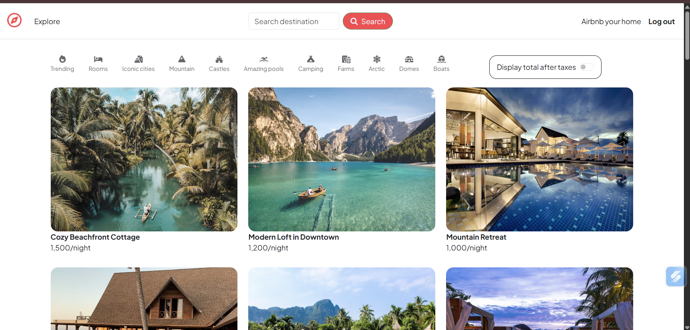
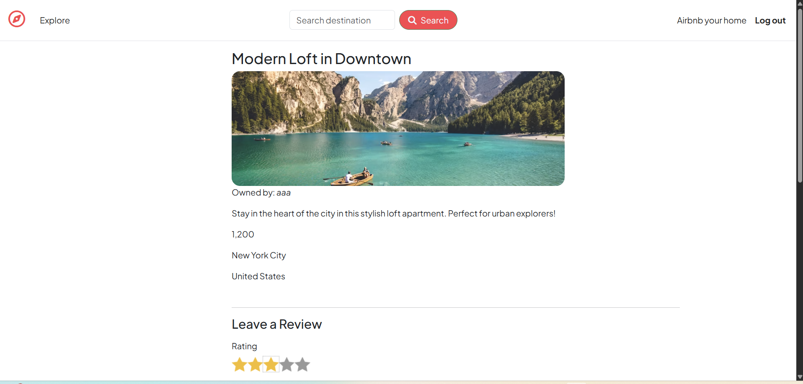
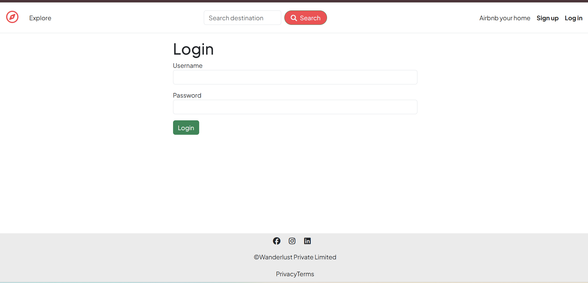
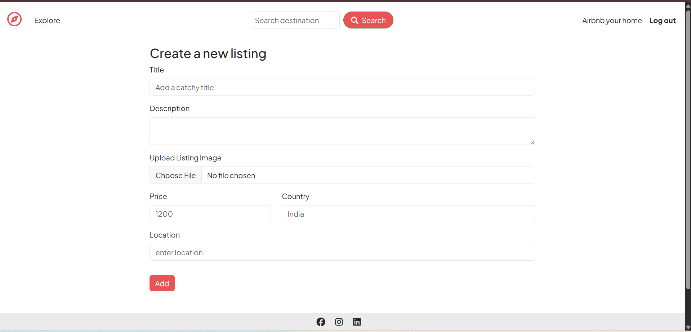

# Airbnb_clone
A full-stack Airbnb-inspired property listing platform built with Node.js, Express.js, MongoDB, and EJS, featuring authentication, reviews, image uploads, and search functionality.
# WanderLust - Airbnb Inspired Property Listing Platform

A full-stack property listing web application built using Node.js, Express.js, MongoDB, and EJS.

## Features

- User Authentication & Authorization
- Property Listings (CRUD Operations)
- Reviews & Ratings
- Image Uploads using Cloudinary
- Search Functionality
- Server-side Validation
- MVC Architecture

## Screenshots

### Home Page

### Listing Details

### Login Page
  

### Create Listing
  

## Tech Stack

- Node.js
- Express.js
- MongoDB
- Mongoose
- EJS
- Passport.js
- Cloudinary
- Bootstrap
